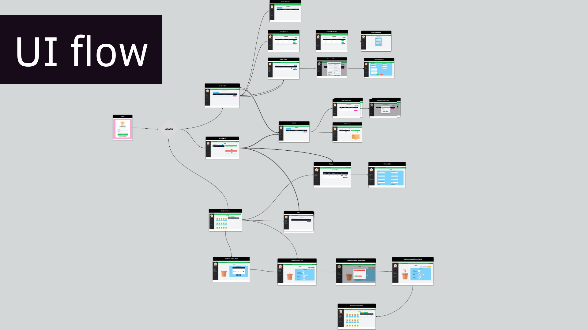

# กลุ่ม Meow

## How to install 
ต้องมี docker

เมื่อทำการติดตั้งครั้งแรก
```sh
docker-compose build
```
คำสั่งรัน
 ```sh
docker-compose up 
```


## id สำหรับการทดสอบ
- id ทดสอบบัญชีเจ้าของ (Owner)   : username = owner,           password = owner123

- id ทดสอบบัญชีฝ่ายขาย (Seller)  : username = seller,             password = seller123

- id ทดสอบบัญชีฝ่ายสวน (Gardener) : username = gardener,       password = gardener123


## รายละเอียดเกี่ยวกับโปรเจค

เว็บแอพพลิเคชั่นระบบจัดการสวนดอกไม้คุณแหม่ม เป็นระบบภายในองค์กรสำหรับเจ้าของและพนักงานในการจัดการงานภายในสวนดอกไม้ เพื่อลดปัญหาการทำงานในรูปแบบปากเปล่าและการบริหารจัดการข้อมูลที่ไม่มีประสิทธิภาพ

ประกอบไปด้วย 3 role ดังนี้
1. Owner สำหรับเจ้าของ ใช้ดูภาพรวมฝั่งขายและยอดขายฝั่งสวน และจัดการบัญชีผู้ใช้งาน
2. Seller สำหรับพนักงานขาย ใช้สำหรับจัดการออเดอร์ของลูกค้า และจัดการสต็อคดอกไม้
3. Gardener สำหรับพนักงานดูแลสวนดอกไม้ คอยจัดการและดูแลสวนที่ปลูก

โดยภายในแบ่งแยกย่อยเป็น 3 ระบบ คือ 1. ระบบจัดการออเดอร์ของฝ่ายขาย 2. ระบบจัดการเพาะปลูกดอกไม้ฝ่ายสวน  3.ระบบดูภาพรวมของเจ้าของและจัดการพนักงาน


## รายชื่อสมาชิกในกลุ่ม

- นางสาวเพชรกมล แสงนวล 6410406819

- นางสาวพัชรินทร์ ขลังวิชา 6410406797

- นายรชต แก้ววิเศษ 6410406843

- นางสาวธัญวรัตม์ ศิริโชติวณิชย์ 6410451091

- นางสาวอรกัญญา ชัยวรพงศา 6410450281

- นางสาวณัฐนันท์ ศรีวิเชียร 6410450931


## Personas

คนที่ 1 : มิน


คนที่ 2 : เจ๊แหม่ม


คนที่ 3 : จีน


## UI flows
# Link : [Figma](https://www.figma.com/file/zAJLaW8MtYGmWUz63XbX1g/Flower-Management?type=design&node-id=496%3A642&mode=design&t=kmB9c5K6XPVAwD3E-1)



## Git branch

มีการแบ่ง branch แยก role หลักๆ  คือ Seller และ Gardener รวมฟีเจอร์ส่วนที่ซับซ้อนต้องใช้หลายส่วน เช่น การอัพเดตดอกไม้หลังเก็บเกี่ยวในสต็อค  รวมถึงกรณี test การทำ docker หรือการลองติดตั้งแพ็คเกจ เช่น maven-front-end plugin และการทำui ที่มีการแยกbranch


## การใช้ Unit Testing

สำหรับการทดสอบ Unit Test มีการใช้ Mockito ในการทดสอบการทำงานของ method ใน service ต่างๆ เนื่องจากสามารถทำการทดสอบได้ง่าย เป็นเครื่องมือที่มีประสิทธิภาพและยืดหยุ่นสำหรับการเขียนการทดสอบ ทำให้สร้างวัตถุจำลอง (mock objects) สำหรับการทดสอบได้ ซึ่งทำให้ไม่ต้องใช้การเรียกใช้จริงของ service ที่เชื่อมโยงกับระบบฐานข้อมูล (database) ที่ทำให้ไม่สะดวกในการใช้งานระหว่างกระบวนการทดสอบ อีกทั้งการใช้ Mockito ทำให้ตรวจสอบได้ว่าทำงานอย่างถูกต้องหรือไม่ เมื่อเรียกใช้จากฐานข้อมูลจริง

ใช้ Mockito ในการทดสอบ service แต่ละคลาส


# Link : [Jira](https://pompu19.atlassian.net/jira/software/projects/MFS/boards/3)

