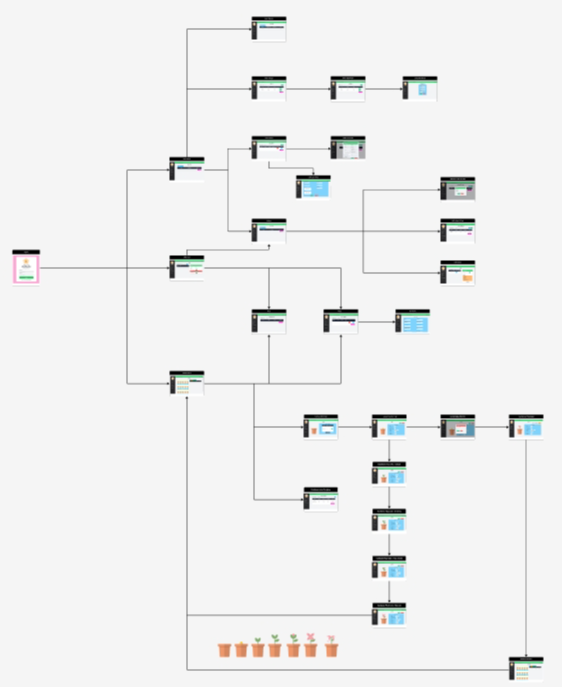

## How to install

```sh
docker-compose build
```

 ```sh
docker-compose up -d
```

- id ทดสอบบัญชีผู้ใช้ owner    : owner              password = owner123

- id ทดสอบบัญชีผู้ใช้ seller   : seller             password = seller123

- id ทดสอบบัญชีผู้ใช้ gardener : gardener123        password = gardener123


## รายละเอียดเกี่ยวกับโปรเจค
เนื่องจากการจัดการสวนของหนึ่งในทีมงานของเรานั้นเป็นการจัดการที่เน้นการทำงานแบบปากเปล่าไม่มีการบริหารจัดการข้อมูลที่มีประสิทธิภาพ ส่งผลให้เกิดิการตกหล่นข้อมูล การสูญหายของข้อมูล การอัพเดทข้อมูลที่ล่าช้า ทางเราจึงได้ทำการพัฒนาสร้างระบบบริหารจัดการสวนดอกไม้ขึ้นเพื่อปรัมปรุงประสิทธิภาพการทำงานให้รวดเร็วและมีความแม่นยำมากยิ่งขึ้น มีข้อมูลรายละเอียดภาพรวมต่างๆเพื่อทำให้เจ้าของสวนนำไปประกอบการตัดสินใจในการบริหารและเพิ่มยอดขายได้

ระบบจัดการสวนหลังบ้านประกอบไปด้วย
Owner สำหรับเจ้าของดูภาพรวมฝั่งขายและยอดขายฝั่งสวน
Seller สำหรับพนักงานขาย ใช้สำหรับจัดการออเดอร์ของลูกค้า และจัดการสต็อคดอกไม้
Gardener สำหรับพนักงานดูแลสวนดอกไม้ คอยจัดการและดูแลสวนที่ปลูก

โดยภายในแบ่งแยกย่อยเป็น 3 ระบบ คือ ระบบยอดจัดการฝ่ายขาย ระบบจัดการเพาะปลูกฝ่ายสวนและระบบดูภาพรวมของเจ้าของ


## รายชื่อสมาชิกในกลุ่ม

- นางสาวเพชรกมล แสงนวล 6410406819

- นางสาวพัชรินทร์ ขลังวิชา 6410406797

- นายรชต แก้ววิเศษ 6410406843

- นางสาวธัญวรัตม์ ศิริโชติวณิชย์ 6410451091

- นางสาวอรกัญญา ชัยวรพงศา 6410450281

- นางสาวณัฐนันท์ ศรีวิเชียร 6410450931


## Personas

คนที่ 1 : มิน


คนที่ 2 : เจ๊แหม่ม


คนที่ 3 : จีน


## UI flows




## Git branch

มีการแบ่ง branch แยก role หลักๆ  คือ Seller และ Gardener รวมฟีเจอร์ส่วนที่ซับซ้อนต้องใช้หลายส่วน เช่น การอัพเดตดอกไม้หลังเก็บเกี่ยวในสต็อค  รวมถึงกรณี test การทำ docker หรือการลองติดตั้งแพ็คเกจ เช่น maven-front-end plugin และการทำui ที่มีการแยกbranch


## การใช้ Unit Testing

สำหรับการทดสอบ Unit Test มีการใช้ Mockito ในการทดสอบการทำงานของ method ใน service ต่างๆ เนื่องจากสามารถทำการทดสอบได้ง่าย เป็นเครื่องมือที่มีประสิทธิภาพและยืดหยุ่นสำหรับการเขียนการทดสอบ ทำให้สร้างวัตถุจำลอง (mock objects) สำหรับการทดสอบได้ ซึ่งทำให้ไม่ต้องใช้การเรียกใช้จริงของ service ที่เชื่อมโยงกับระบบฐานข้อมูล (database) ที่ทำให้ไม่สะดวกในการใช้งานระหว่างกระบวนการทดสอบ อีกทั้งการใช้ Mockito ทำให้ตรวจสอบได้ว่าทำงานอย่างถูกต้องหรือไม่ เมื่อเรียกใช้จากฐานข้อมูลจริง

ใช้ Mockito ในการทดสอบ service แต่ละคลาส


# Link : [Jira](https://pompu19.atlassian.net/jira/software/projects/MFS/boards/3)

